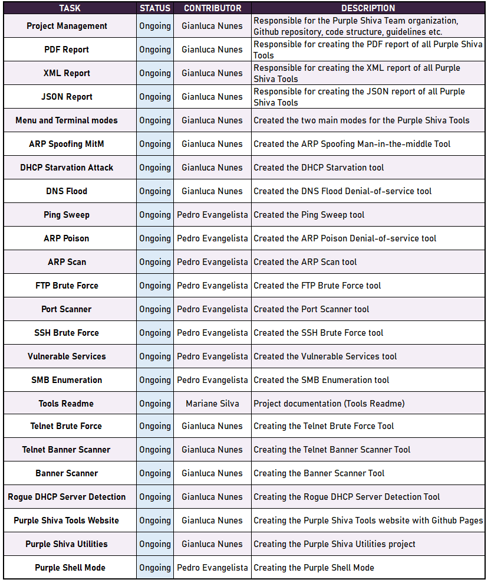

&nbsp;

# Purple Shiva Tools 🔱

Cybersecurity toolkit designed to help beginners ramp up quickly.
Rich documentation, usage examples, and tutorials — easy to extend.

Currently we are working only with Python 3.13.3 with the goal of expanding to other programming languages in the near future.

&nbsp;

- Developed by: Purple Shiva Team && Gianluca Nunes

&nbsp;

&nbsp;

# ❗ Project Under Development ❗

&nbsp;

This project is currently under development.

This repository will be updated as the project progresses.

Current version: Alpha V0.2 🔖

To see the current work, change the branch to "alpha".

&nbsp;

&nbsp;

## 🤝 Contributors and current work

&nbsp;

 
&nbsp;

# ⚠️ REMEMBER: ONLY USE PURPLE SHIVA TOOLS ON AUTHORIZED ENVIRONMENTS! ⚠️
